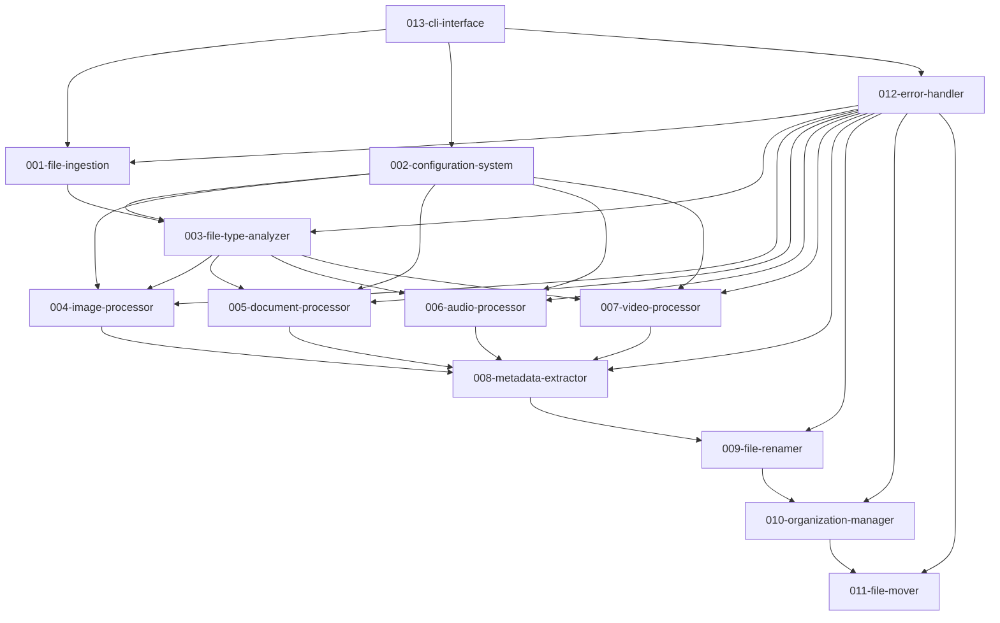

# Spec-Kit Workflow for Vault of Memories

## Overview

This document outlines the proper spec-kit workflow for breaking down the Vault of Memories digital vault pre-processor into focused, modular specifications.

## Workflow Steps

### Phase 1: Foundation Components

#### Step 1: File Ingestion System

```bash
/specify Build a file ingestion system that accepts single files, multiple files, or nested folder structures as input. The system calculates SHA-256 checksums for each file and checks for duplicates against an SQLite database. It removes system/hidden files (.DS_Store, Thumbs.db) during cleanup and routes non-duplicate files to the next processing stage.
```

**Expected Output**: `specs/001-file-ingestion/`

- Handles file input validation
- SHA-256 checksum calculation
- SQLite duplicate detection
- System file cleanup
- Basic file routing

#### Step 2: Configuration Management System

```bash
/specify Build a configuration management system that loads and validates JSON configuration files for the vault processor. The system provides centralized access to settings, filename rules, classification rules, processing rules, and manufacturer mappings. It validates configuration integrity and handles configuration updates.
```

**Expected Output**: `specs/002-configuration-system/`

- JSON configuration loading
- Configuration validation
- Centralized settings access
- Configuration file management

#### Step 3: File Type Analysis System

```bash
/specify Build a file type analyzer that uses python-magic for MIME type detection to definitively identify file types based on content rather than extensions. The system validates file extensions against actual content and routes files to appropriate specialized processors based on detected type.
```

**Expected Output**: `specs/003-file-type-analyzer/`

- MIME type detection using python-magic
- Extension validation against content
- File routing to processors
- Unknown/corrupted file handling

### Phase 2: Specialized Processors

#### Step 4: Image Processing System

```bash
/specify Build an image processor that handles both photos and graphics. The system extracts EXIF data using Pillow to distinguish camera photos from other images, extracts resolution and camera information, determines raw vs processed classification based on file extensions, and preserves original creation timestamps.
```

**Expected Output**: `specs/004-image-processor/`

- EXIF data extraction
- Photo vs image classification
- Raw vs processed determination
- Camera metadata extraction

#### Step 5: Document Processing System

```bash
/specify Build a document processor that handles various document formats including PDFs, Office documents, and text files. The system counts PDF pages to classify documents as brochures (≤5 pages) or ebooks (>5 pages), extracts document metadata like creation date and author, and handles OCR content matching for scanned documents.
```

**Expected Output**: `specs/005-document-processor/`

- PDF page counting for classification
- Document metadata extraction
- OCR content handling
- Multiple format support

#### Step 6: Audio Processing System

```bash
/specify Build an audio processor that extracts ID3 tags and metadata from audio files using mutagen. The system gets duration, bitrate, and format information, extracts artist, album, and creation date information, and handles various audio formats consistently.
```

**Expected Output**: `specs/006-audio-processor/`

- ID3 tag extraction using mutagen
- Audio metadata extraction
- Duration and format detection
- Multiple audio format support

#### Step 7: Video Processing System

```bash
/specify Build a video processor that extracts metadata from video files using pymediainfo. The system gets duration, resolution, and fps information, extracts creation date and camera information when available, and determines video categories (family, tutorials, work, tech, etc.) based on content analysis.
```

**Expected Output**: `specs/007-video-processor/`

- Video metadata extraction using pymediainfo
- Duration, resolution, fps detection
- Video categorization
- Camera information extraction

### Phase 3: Organization and Output

#### Step 8: Metadata Coordination System

```bash
/specify Build a metadata extractor that coordinates between specialized processors and consolidates metadata from multiple sources. The system applies metadata priority rules (EXIF > filename > filesystem), handles timezone preservation without UTC conversion, and standardizes manufacturer names using configurable mappings.
```

**Expected Output**: `specs/008-metadata-extractor/`

- Metadata source prioritization
- Cross-processor coordination
- Manufacturer name standardization
- Timezone preservation

#### Step 9: File Naming System

```bash
/specify Build a file renamer that generates standardized, human-readable filenames using extracted metadata. The system applies configurable naming patterns with metadata components (date, time, size, resolution, etc.), ensures filename uniqueness across the vault, handles filename length limits, and uses 8-digit padding for counters.
```

**Expected Output**: `specs/009-file-renamer/`

- Template-based filename generation
- Metadata component formatting
- Uniqueness enforcement
- Length and character validation

#### Step 10: Organization Management System

```bash
/specify Build an organization manager that determines final file placement in the vault structure. The system applies content classification rules, creates date-based folder hierarchy (YYYY/YYYY-MM/YYYY-MM-DD), ensures folder structure consistency, and handles edge cases in file classification.
```

**Expected Output**: `specs/010-organization-manager/`

- Content-type classification
- Date-based folder creation
- Vault structure management
- Classification edge cases

#### Step 11: File Operations System

```bash
/specify Build a file mover that handles final file operations including moving files to vault locations, creating destination directories, handling duplicates and quarantine files, updating database records, and ensuring atomic operations to prevent data loss.
```

**Expected Output**: `specs/011-file-mover/`

- Atomic file operations
- Directory creation
- Database updates
- Error recovery

### Phase 4: Integration and Interface

#### Step 12: Error Management System

```bash
/specify Build an error handler that provides centralized error management across all processing components. The system logs errors with context, moves problematic files to categorized quarantine folders (corrupted, unsupported, processing-errors), generates error reports, and handles recovery scenarios.
```

**Expected Output**: `specs/012-error-handler/`

- Centralized error logging
- Quarantine management
- Error categorization
- Recovery mechanisms

#### Step 13: CLI Integration System

```bash
/specify Build a command-line interface that orchestrates the entire vault processing pipeline. The system coordinates all processing modules, provides progress feedback, generates processing summaries, handles global error reporting, and allows manual triggering of the processing workflow.
```

**Expected Output**: `specs/013-cli-interface/`

- Pipeline orchestration
- Progress reporting
- User interface
- Global coordination

## Dependencies



## Implementation Order

1. **Foundation** (001-003): Core infrastructure
2. **Processors** (004-007): Parallel development possible
3. **Organization** (008-011): Sequential, depends on processors
4. **Integration** (012-013): Final integration layer

## Next Steps

1. Run each `/specify` command in order
2. For each spec, run `/plan` to create implementation plan
3. Use `/tasks` to break down into actionable items
4. Use `/implement` for development

## Benefits of This Approach

- **Focused Specifications**: Each spec has clear, single responsibility
- **Independent Development**: Components can be developed in parallel
- **Clear Dependencies**: Explicit relationships between components
- **Testable Units**: Each component can be tested independently
- **Incremental Delivery**: Can deliver value component by component
